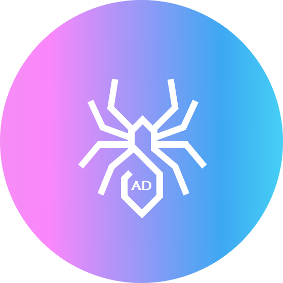
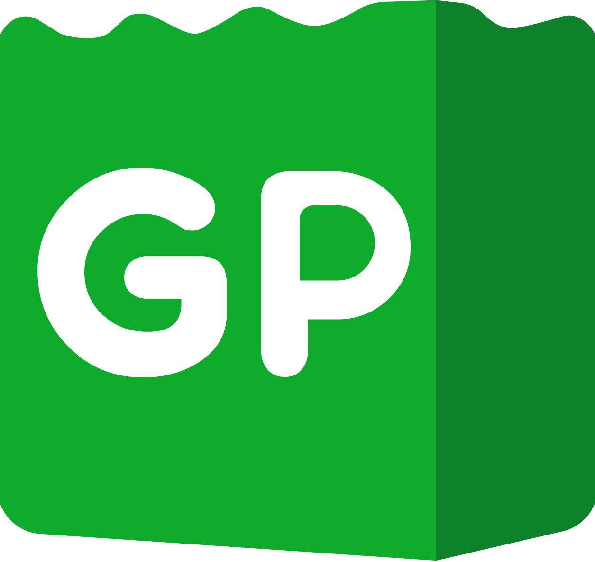

      
      
      
      

<h1 align="center">
  Ibrahim Chhaya
</h1>

Welcome to my GitHub page! Here you'll find all of my projects, old and new, as well as my [UI design portfolio](https://github.com/IbrahimChhaya/MyUIDesigns).

<h2 align="center">
  🏗️ This page is still under construction 🏗️
</h2>

### A Little About Me:

📚 Currently studying BSc Honours in Information Technology at the University of Johannesburg (almost done!)

😺 I like cats

🌱 Plant dad

🎮 Xbox, PlayStation, and PC gamer

### Stuff I Know:

### Stuff I Don't Know:
A lot, but I'm always looking to learn something new 💡

### Stuff I Use:

### Stuff I've Worked On:
 Immune Raider: immune system inspired game AI. Top 5 at UJ's 36th Projects Day. [More details here](https://github.com/IbrahimChhaya/MyUIDesigns/tree/main/ImmuneRaider)

 cura: mobile app and webapp for children, guardians, and psychologists. Top 2 and Best Website at UJ's 35th Projects Day. [More details here](https://github.com/IbrahimChhaya/MyUIDesigns/tree/main/cura)

 Green Pantry: more than just an ecommerce site. Winner of UJ's 34th Projects Day. [More details here](https://github.com/IbrahimChhaya/MyUIDesigns/tree/main/GreenPantry)

### Connect With Me:

