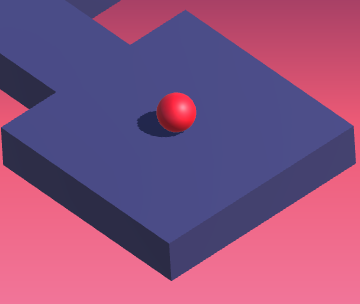

      
      
      
      

<h1 align="center">
  Ibrahim Chhaya
</h1>

Welcome to my GitHub page! Here you'll find all of my projects, old and new.

<h2 align="center">
  🏗️ This page is still under construction 🏗️
</h2>

### A Little About Me:

📚 Currently studying MSc in Information Technology Privacy Engineering at Carnegie Mellon University

😺 I like cats

🌱 Plant dad

🎮 Xbox, PlayStation, and PC gamer

### Stuff I Know:

 Certificate in Fundamentals of Deep Learning

### Stuff I Don't Know:
A lot, but I'm always looking to learn something new 💡

### Stuff I Use:

### Stuff I've Worked On:
🌱 Two Plant Tracking apps using VueJS, Quasar, and AWS. More details [here](https://github.com/IbrahimChhaya/VueJS-Plant-App-AWS) and [here](https://github.com/IbrahimChhaya/QuasarPlantApp)

 Immune Raider: artificial immune system inspired game AI. Top 4 at UJ's 36th Projects Day. [More details here](https://github.com/IbrahimChhaya/ImmuneSystemGame)

 cura: mobile and web app for children, guardians, and psychologists. Top 2 and Best Website at UJ's 35th Projects Day. [More details here](https://github.com/IbrahimChhaya/cura)

 Green Pantry: more than just an ecommerce site. Winner of UJ's 34th Projects Day. [More details here](https://github.com/IbrahimChhaya/GreenPantry)

 RollThing: An infinite zigzig ball rolling game created to self-learn mobile game development with the Unity game engine. [More details here](https://github.com/IbrahimChhaya/RollThing)

### Connect With Me:

